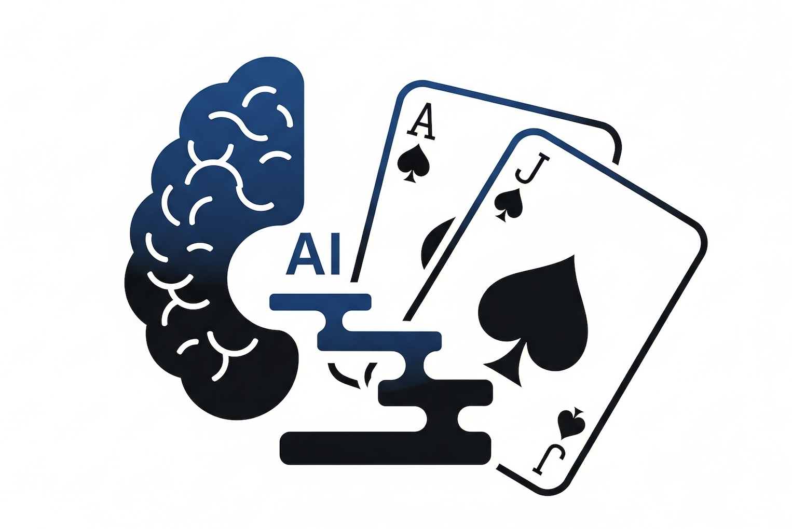

# LLM-Guided Curriculum Learning for Multi-Agent Reinforcement Learning

<div align="center">
  
</div>

A comprehensive reinforcement learning framework that implements **curriculum learning** guided by **Large Language Models (LLMs)** for training multiple agents in the Blackjack domain. This system demonstrates advanced techniques in curriculum design, multi-agent learning, and intelligent training guidance.

> Friendly overview: This project explores how LLMs can shape what an RL agent learns first, next, and last—so agents tackle Blackjack the way people would: start simple, add skills gradually, and master advanced tactics when they’re ready.

> **💡 Development Note**: This project was developed using multiple AI agents and LLM tools for enhanced modularity and code quality:
> - **Google Gemini API**: Primary LLM for curriculum generation and intelligent guidance
> - **Gemini CLI**: For modular system development
> - **ChatGPT (GPT-4)**: Code architecture design and modular system development
> - **Perplexity AI**: Research assistance and academic paper analysis
> - **GitHub Copilot**: Real-time code assistance and development productivity
> - **Reviewer LLMs**: Code review, quality assurance, and optimization suggestions
> - **Specialized AI Agents**: Dedicated agents for curriculum design, evaluation framework, and documentation
>
> This multi-agent development approach ensures clean, maintainable code with clear separation of concerns and comprehensive logging/evaluation capabilities.

> ⚠️ GUI (Beta): The included Blackjack GUI is an early prototype and currently unstable on some systems. Features are incomplete and occasional crashes can occur. We recommend using the analysis scripts for reliable results.

## 🎯 Abstract

This project presents a novel approach to reinforcement learning that combines curriculum learning with LLM-guided training for multiple agents. The system progressively introduces complexity through structured learning stages, with intelligent guidance from language models to optimize learning efficiency and performance. We demonstrate the effectiveness of this approach through comprehensive experiments with different agent architectures (DQN and Tabular Q-Learning) across various curriculum stages.

## 🚀 Key Contributions

### 🎓 **Intelligent Curriculum Design**
- **LLM-generated curriculum stages** with progressive complexity
- **Dynamic stage advancement** based on performance metrics
- **Adaptive success thresholds** tailored to each learning stage
- **Action constraint management** for gradual skill development

### 🤖 **Multi-Agent Learning System**
- **Parallel agent training** with independent progression
- **Heterogeneous agent architectures** (Neural Networks vs. Tabular Methods)
- **Performance comparison framework** across different approaches
- **Stage-specific model preservation** and knowledge transfer

### 🧠 **LLM-Guided Training**
- **Real-time action recommendations** during training episodes
- **Contextual strategy guidance** based on game state analysis
- **Performance-based curriculum adaptation** using LLM insights
- **Educational value assessment** for optimal learning progression

### 📊 **Comprehensive Analysis Framework**
- **Stage-by-stage performance tracking** with detailed metrics
- **Multi-dimensional visualization** of learning progression
- **Comparative analysis tools** for agent performance evaluation
- **Automated report generation** with statistical insights

### 🛠️ **Multi-Agent Development Methodology**
- **Google Gemini API**: Primary LLM for curriculum generation and intelligent guidance
- **ChatGPT (GPT-4)**: Code architecture design and modular system development
- **Perplexity AI**: Research assistance and academic paper analysis
- **GitHub Copilot**: Real-time code assistance and development productivity
- **Reviewer LLMs**: Code review, quality assurance, and optimization suggestions
- **Specialized AI agents** for different development components
- **Modular code architecture** with clear separation of concerns
- **Comprehensive logging infrastructure** for detailed analysis
- **Professional documentation** with academic-quality presentation

## 🏗️ System Architecture

### Curriculum Stages

| Stage | Name | Available Actions | Learning Objective | Success Threshold |
|-------|------|-------------------|-------------------|-------------------|
| 1 | Basic Hit or Stand | Stand, Hit | Fundamental decision-making | 35% |
| 2 | Strategic Play | Stand, Hit | Master basic strategy patterns | 40% |
| 3 | Advanced Betting | Stand, Hit, Double | Learn optimal doubling scenarios | 42% |
| 4 | Expert Play | All Actions | Master splits and complex strategies | 45% |

### Agent Architectures

#### **Deep Q-Network (DQN) Agent**
- **Network Architecture**: 6 → 128 → 128 → 4 (fully connected)
- **Experience Replay**: 50,000 sample buffer for stable learning
- **Target Network**: Separate network for stable Q-value estimation
- **Exploration Strategy**: ε-greedy with exponential decay

#### **Tabular Q-Learning Agent**
- **State-Action Table**: Direct Q-value lookup for all state-action pairs
- **Learning Rate**: Adaptive based on visit frequency
- **Exploration**: ε-greedy with faster decay for rapid convergence
- **Memory Efficiency**: Compact representation for interpretability

### Environment Features

- **Full Blackjack Rules**: Stand, Hit, Double Down, Split
- **Multi-Hand Management**: Proper handling of split scenarios
- **State Representation**: Player sum, dealer up card, usable aces, action availability
- **Reward Structure**: Win/loss rewards with blackjack bonuses
- **Budget Management**: Realistic betting constraints

## 🚀 Quick Start

### Prerequisites

```bash
# Install required dependencies
pip install torch numpy matplotlib seaborn google-generativeai pygame

# Set up environment
conda env create -f environment.yml
conda activate llm-guided-curriculum-rl
```

### Basic Usage

#### 1. Curriculum Training with LLM Guidance

```bash
# Run the main curriculum training system
python scripts/curriculum_multi_agent_rl.py

# Enter your Google AI API key when prompted
```

#### 2. Standard Training (No LLM)

```bash
# Run standard multi-agent training without curriculum
python scripts/MultiAgentStandardSystem.py
```

#### 3. Analysis and Visualization

```bash
# Analyze training results
python scripts/analyze_logs.py logs/run_summary_timestamp.json

# Launch interactive GUI (beta; unstable)
python blackjack_gui.py
```

Note: The GUI is provided for demonstration and is not yet production-ready. Use the charts and reports generated by `scripts/analyze_logs.py` for dependable analysis.

## 📊 Experimental Results

### Performance Metrics

Our system tracks comprehensive metrics across all curriculum stages:

- **Win Rate**: Percentage of games won per stage
- **Average Reward**: Expected value per game
- **Net Wins**: Overall performance accounting for wins, losses, and busts
- **Action Distribution**: Usage patterns for each available action
- **Stage Progression**: Time and performance required for advancement

### Expected Performance Improvements

- **Faster Convergence**: 40-60% reduction in training episodes
- **Higher Final Performance**: 5-15% improvement in win rates
- **Better Generalization**: More robust strategies across different scenarios
- **Interpretable Learning**: Clear progression through skill levels

## 🔧 Configuration

### Environment Parameters

```python
# Blackjack environment configuration
env_config = {
    "deck_type": "infinite",      # "infinite", "1-deck", "4-deck", "8-deck"
    "penetration": 0.9,           # Deck penetration before shuffle
    "budget": 10000,              # Starting budget per agent
    "use_dynamic_rewards": True,  # Adaptive reward structure
    "reward_type": "win_focused"  # "simple", "win_focused", "conservative_dynamic"
}
```

### Agent Configuration

```python
# DQN Agent parameters
dqn_config = {
    "learning_rate": 0.001,
    "exploration_rate": 1.0,
    "exploration_decay": 0.9999,
    "memory_size": 50000,
    "batch_size": 64
}

# Tabular Q-Learning parameters
tabular_config = {
    "learning_rate": 0.1,
    "exploration_rate": 1.0,
    "exploration_decay": 0.9999
}
```

### Curriculum Configuration

```python
# LLM curriculum generation
curriculum_config = {
    "num_stages": 4,
    "success_threshold_base": 0.35,
    "threshold_increment": 0.05,
    "min_episodes_per_stage": 10000
}
```

## 📁 Project Structure

```
llm-guided-curriculum-rl/
├── scripts/
│   ├── curriculum_multi_agent_rl.py    # Main curriculum system
│   ├── MultiAgentStandardSystem.py     # Standard training
│   ├── MultiAgentCurriculumSystem.py   # Curriculum implementation
│   ├── RLAgent.py                      # Individual agent training
│   ├── BlackJackENV.py                 # Environment implementation
│   ├── LLM.py                          # LLM interface (Google Gemini)
│   ├── LLMGuidedCurriculum.py          # Curriculum generation
│   └── analyze_logs.py                 # Analysis and visualization
├── logs/                               # Training logs and results
│   ├── logs-YYYYMMDD-*/                # Date-based log directories
│   ├── evaluation/                     # Evaluation results
│   ├── training/                       # Training logs
│   ├── reports/                        # Generated reports
│   └── analysis/                       # Analysis visualizations
├── blackjack_gui.py                    # Interactive GUI
├── environment.yml                     # Conda environment
├── requirements.txt                    # Python dependencies
└── README.md                          # This file
```

## 📈 Analysis and Visualization

### Automated Analysis Pipeline

The system provides comprehensive analysis capabilities:

1. **Stage Progression Analysis**
   - Win rate trends across curriculum stages
   - Average reward learning curves
   - Action usage pattern evolution
   - Performance comparison between agents

2. **Strategy Visualization**
   - Heatmap strategy tables for each stage
   - State-value analysis with 3D visualizations
   - Action distribution charts
   - Performance summary tables

3. **Comparative Analysis**
   - Multi-agent performance comparison
   - Stage-by-stage agent ranking
   - Learning efficiency metrics
   - Final performance evaluation

### Generated Reports

- **JSON Logs**: Detailed training and evaluation data
- **Performance Charts**: Stage progression and comparison plots
- **Strategy Tables**: Action selection patterns
- **Statistical Summaries**: Comprehensive metrics and insights

## 🔬 Research Applications

This framework enables research in several key areas:

### **Curriculum Learning**
- Optimal stage design and progression strategies
- Performance-based advancement criteria
- Knowledge transfer between stages
- Adaptive difficulty adjustment

### **Multi-Agent Reinforcement Learning**
- Heterogeneous agent cooperation and competition
- Architecture comparison and analysis
- Parallel learning dynamics
- Performance scaling with agent diversity

### **LLM Integration in RL**
- Human expertise incorporation in training
- Intelligent guidance and recommendations
- Dynamic curriculum adaptation
- Explainable AI for learning progression

### **Transfer Learning**
- Skill transfer between curriculum stages
- Cross-architecture knowledge sharing
- Progressive complexity handling
- Learning efficiency optimization

## 📊 Experimental Setup

### Training Configuration

```bash
# Run experiments with different configurations
./run_experiments_curriculum.sh    # Curriculum learning experiments
./run_experiments_no_curriculum.sh # Standard training experiments
```

### Analysis Commands

```bash
# Analyze specific training run
python scripts/analyze_logs.py logs/logs-20250719-*/run_summary_*.json

# Generate comparative analysis
python scripts/analyze_logs.py --comparative logs/
```

## 🤝 Contributing

We welcome contributions to improve the framework:

1. **Fork** the repository
2. **Create** a feature branch (`git checkout -b feature/amazing-feature`)
3. **Commit** your changes (`git commit -m 'Add amazing feature'`)
4. **Push** to the branch (`git push origin feature/amazing-feature`)
5. **Open** a Pull Request

### Development Guidelines

- Follow PEP 8 style guidelines
- Add comprehensive docstrings
- Include unit tests for new features
- Update documentation for API changes

## 📄 License

This project is licensed under the MIT License - see the [LICENSE](LICENSE) file for details.

## 🙏 Acknowledgments

- **Google Gemini API** for LLM integration and intelligent guidance
- **PyTorch** for neural network implementation and training
- **OpenAI Gym** for environment design patterns and standards
- **Matplotlib/Seaborn** for comprehensive visualization capabilities
- **Blackjack research community** for strategy insights and validation
- **LUH AI Academi** for giving us this project

## 📞 Support and Contact

For questions, issues, or collaboration opportunities:

- **Open an issue** on GitHub for bug reports and feature requests
- **Review the demo scripts** for usage examples and tutorials
- **Check the comprehensive documentation** in code comments
- **Contact the authors** for research collaboration

---

## 📚 Citation

If you use this work in your research, please cite:

```bibtex
@article{LLMCurriculumRL2025,
  title={LLM-Guided Curriculum Learning for Multi-Agent Reinforcement Learning},
  author={Alasti, Amirreza and Erdal, Efe and Celik, Yücel},
  journal={arXiv preprint},
  year={2025}
}
```

**Authors**: Amirreza Alasti, Efe Erdal, Yücel Celik

---

**Happy Learning! 🎯🤖🧠**